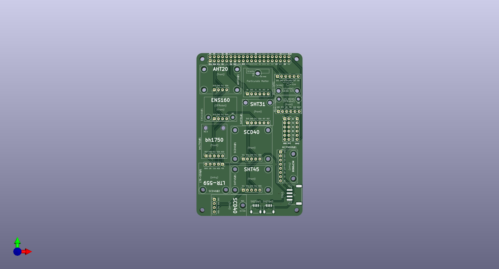
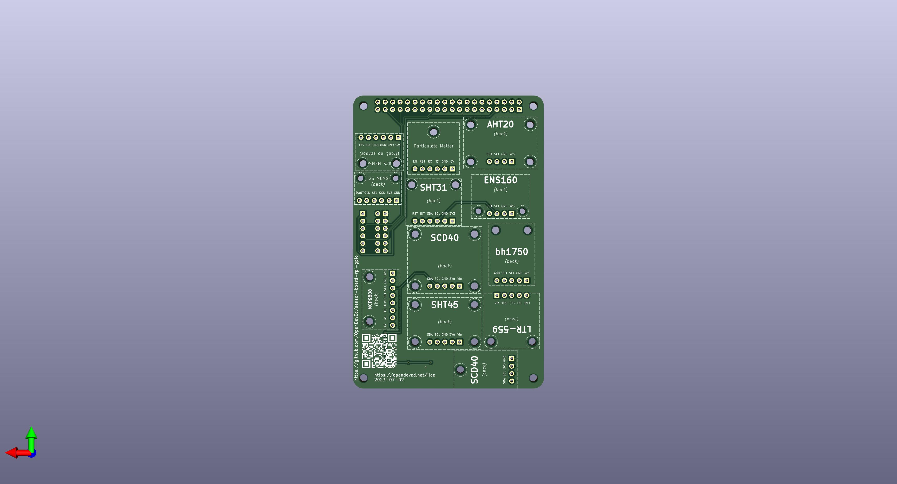

# sensor-board-rpi-gpio

This is a breakout board for the Raspberry Pi GPIO. The purpose of the board is to testing several sensor sensor breakouts available in the UK, including the following:
* AHT20 (Adafruit)
* BH1750 (DFRobot/Femion)
* ENS160 (DFRobot/Femion)
* I2S MEMS Mic (Adafruit)
* I2S MEMS Mic (DFRobot/Femion)
* LTR-559 (Pimoroni)
* MCP9808 (Adafruit)
* SHT31 (Adafruit)
* SHT40/45 (Adafruit)
* SCD40/41 (Adafruit, Pimoroni, ebay)

Certain GPIO are not utilised by the board, because the board is meant to function with the Adafruit LoRa Bonnet (and PiJuice Zero).

Motivation: https://opendeved.net/ilce

